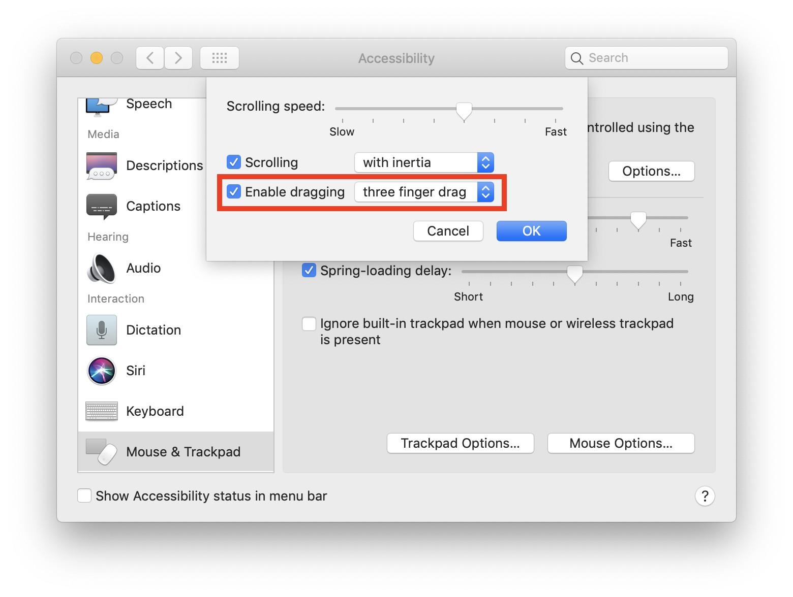
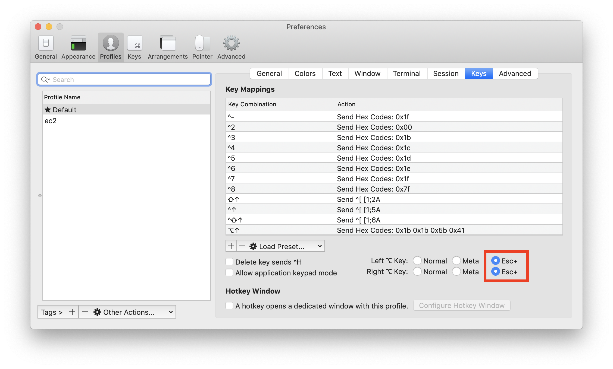
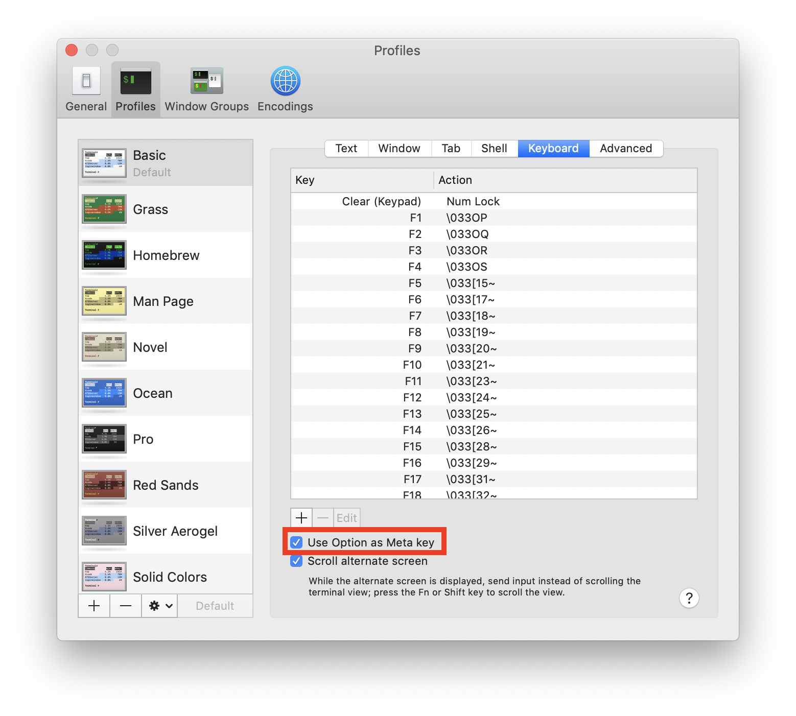

# Devteam

An opinionated setup guide for working in dev teams with me.

## OS X

Enable three-finger drag. Why this isn't just on by default is beyond me. In System Settings > Accessibility > Mouse & Trackpad:

## Terminal

Use iterm2 over OS X terminal. It's easier to customize and has more dev-friendly features.

Map `option` to `+Esc` or `meta`. Many time-saving bash hotkeys use it.

Or, if you still insist on using the native Terminal app,

